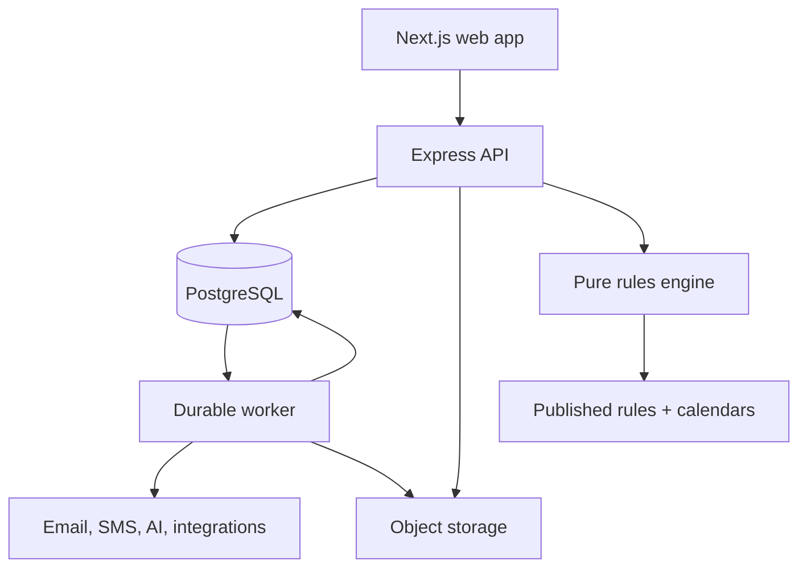

# PopEngine — Architecture Target (Phase 2+)

**Status:** PROPOSED (per `BASELINE.md`) — the destination architecture for Phases 2–4, adopted as a planning target 2026-07-22 so stretch work never needs re-planning. **This document is NOT the build instruction for Phase 0–1.5; `ARCHITECTURE.md` is.** Do not build workers, tenancy, event revisions, OpenAPI contracts, or the AI gateway before their roadmap phase; AGENTS.md forbids building toward this document early.
**Origin:** delivered by an external documentation audit (2026-07-22, `docs/proposals/documentation-audit-2026-07-22.md`); section references to "the supplied rules file"/"v2 scenario suite" predate the corrected nyc.v2.3 baseline and should be read as "the then-current draft."
**Companion authority:** Product scope lives in `PRD.md`; phase assignment in `ROADMAP.md`; approved feature behavior in `/specs`; regulatory facts in approved primary sources and published rulesets.

## 1. Architectural goals

PopEngine must:

1. Produce deterministic, source-traceable regulatory findings without using AI as a decision maker.
2. Say when it is conditional, incomplete, conflicted, or outside coverage; it must never label a partial plan complete.
3. Preserve exactly which event answers, rules, engine, and calendar produced every plan.
4. Allow the Event record to grow from planning through compliance, marketing, operations, and post-event intelligence without becoming one unmaintainable table.
5. Support four developers working in parallel through versioned contracts and bounded modules.
6. Start as a modular monolith and add operational components only when roadmap capabilities require them.
7. Protect documents, contact data, consent, and workspace data before real users are admitted.

## 2. Architecture decisions

| ID | Decision | Consequence |
|---|---|---|
| AD-01 | Use a TypeScript monorepo with a Next.js web app, Express API, and a worker process. | Web, API, worker, and pure packages share versioned contracts but deploy independently. Exact Node, pnpm, Next.js, and TypeScript versions are pinned in-repo. |
| AD-02 | Build a modular monolith, not microservices. | Domain modules have explicit APIs and table ownership, but one repository and one PostgreSQL database. Extract a service only after measured operational need. |
| AD-03 | Keep the rules engine pure: no database, HTTP, environment reads, random values, or system clock. | Evaluation receives event revision, ruleset, `today`, timezone, engine version, and calendar data as explicit inputs. |
| AD-04 | Treat published rulesets as immutable artifacts. | Git is the publication workflow through Phase 3. The rules admin system in Phase 4 publishes the same immutable artifact format; it does not create a second runtime truth. |
| AD-05 | Separate stable Event identity from immutable Event Revisions. | Editing intake answers creates a new revision. A plan always references one exact revision; staleness is computed server-side. |
| AD-06 | Treat plans as immutable evaluations and findings as immutable snapshots. | Regeneration creates a new plan, preserves the old plan, and produces a diff. Active workflow data is never silently rewritten. |
| AD-07 | Use a layered status model. | Coverage, finding type, deadline status, and workflow status are separate fields. The obsolete `FEASIBLE` flat verdict is not stored or exposed. |
| AD-08 | Represent conditions and calculations with validated typed data. | No `eval`, dynamic code, or natural-language formulas. Rules use a condition AST and either a calculation AST or a named, versioned calculator. |
| AD-09 | Use PostgreSQL as the system of record and S3-compatible object storage for file bytes. | File metadata and authorization stay in PostgreSQL; downloads use short-lived signed URLs. |
| AD-10 | Use a durable PostgreSQL-backed jobs/outbox model. | Phase 1 alerts may share the API deployment, but job claiming and delivery are durable. Phase 2 runs the same code as a separate worker. Redis is not required. |
| AD-11 | Introduce authentication before any real-user beta. | A no-account capstone demo is permitted only behind an environment access gate with synthetic data. CORS is never treated as authorization. |
| AD-12 | Make workspace tenancy the authorization boundary. | Once F-701/F-702 ship, every user-owned aggregate carries `workspace_id`; authorization is enforced server-side in one policy layer. |
| AD-13 | Put every external service behind an adapter. | Email, SMS, storage, geocoding, AI, ticketing, calendar, and POS providers cannot leak provider-specific shapes into domain code. |
| AD-14 | Route all AI work through an AI gateway with proposal semantics. | AI may draft or extract. Material extracted values require confirmation; AI cannot publish a rule or authoritatively determine a permit. |
| AD-15 | Make OpenAPI, JSON Schema, migrations, and executable fixtures first-class contracts. | Prose explains behavior; machines enforce the contract. Shared contract changes require coordinated review before feature branches consume them. |

## 3. System context



The API owns synchronous commands and reads. The worker owns retryable or scheduled side effects. The engine is a library used by the API, test runner, and rules-admin preview; it never calls the other components.

## 4. Repository boundaries

```text
/apps/web                         Next.js organizer, public, attendee, and admin UI
/apps/api                         Express HTTP API and synchronous orchestration
/apps/worker                      Scheduled jobs, delivery, extraction, ingestion, webhooks
/packages/contracts               Generated/shared TypeScript types from approved schemas
/packages/engine                  Pure condition, classification, deadline, fee, and aggregation logic
/packages/domain                  Domain services grouped by module; no HTTP/provider code
/packages/db                      Queries, transactions, migrations, and row mappings
/packages/notifications           Channel-neutral messages, consent, suppression, provider adapters
/packages/integrations            Calendar, ticketing, POS, geocoding, and webhook adapters
/packages/ai                      AI gateway, prompt versions, proposal schemas, safety checks
/contracts/openapi.yaml           Authoritative HTTP contract
/contracts/event-input.v2.schema.json
/rules/schemas/ruleset.v2.schema.json
/rules/published/nyc.v2.json      Current immutable published artifact
/rules/calendars                  Versioned jurisdiction holiday calendars
/rules/fixtures/v2               Exact executable inputs and expected outputs
/specs                            One approved specification per scheduled F-id
/docs/adr                         Durable architecture decisions
/docs                             Product, delivery, governance, security, and operations docs
```

Import rules are enforced with lint/build boundaries:

- `engine` imports only contracts and pure utilities.
- `domain` may import contracts and engine; it does not import Express, Next.js, or provider SDKs.
- `api` and `worker` call domain services and adapters.
- `web` consumes the OpenAPI client and shared presentation-safe enums; it never imports database code.
- No feature redefines an intake, finding, status, or API type locally.

## 5. Authoritative machine contracts

| Contract | Authority | Change rule |
|---|---|---|
| Event input | `contracts/event-input.v2.schema.json` | Breaking changes require a new schema version and migration/compatibility plan. |
| Rules artifact | `rules/schemas/ruleset.v2.schema.json` | A rules file cannot publish or boot unless schema validation succeeds. |
| Regulatory behavior | Approved fixtures under `rules/fixtures/v2` | Fixtures cite an approved rule/source. A lower-authority expected result changes when the approved source or rule changes. |
| HTTP | `contracts/openapi.yaml` | API implementation and generated client must pass contract tests. |
| Database | Ordered migrations | Existing migrations are immutable after merge. New changes use a forward migration and tested rollback/repair path. |
| Feature behavior | Approved `specs/F-xxx-*.md` | The implementation may not add behavior outside the scheduled spec. |

The current baseline is listed in `docs/BASELINE.md` with status and checksum. Agents stop when two approved contracts disagree; they do not choose one silently.

## 6. Event and jurisdiction model

### 6.1 Stable Event identity

`events` is a stable container, not the complete questionnaire.

| Column | Purpose |
|---|---|
| `id` | UUID primary key. |
| `workspace_id` | Nullable only in the gated capstone mode; required once accounts ship. |
| `jurisdiction_code` | Initial value `US-NY-NYC`; never inferred from display text. |
| `title` | Organizer-facing event name. |
| `timezone` | IANA timezone, initially `America/New_York`. |
| `starts_at`, `ends_at` | Public/operational timestamps; nullable during draft intake. |
| `current_revision_id` | Latest saved event revision. |
| `current_plan_id` | Latest accepted plan, not merely latest generated candidate. |
| `lifecycle_status` | `draft`, `planning`, `published`, `live`, `completed`, `cancelled`, `archived`. |
| timestamps | Creation and update audit metadata. |

Regulatory `event_date` is derived as the local calendar date of `starts_at`, or collected directly while the event is an early draft. Date-only regulatory math never relies on a UTC conversion.

### 6.2 Immutable Event Revisions

`event_revisions` stores:

- `id`, `event_id`, monotonically increasing `revision_number`;
- `input_schema_version` and jurisdiction;
- complete validated `answers_json`;
- selected indexed projections used for search/filtering, such as local event date, location type, and headcount;
- `created_by`, `created_at`, and `supersedes_revision_id`;
- conflict/validation results recorded at save time.

Every engine-relevant answer, including explicit `unknown`, lives in the revision. SQL `NULL` means not present in this schema version, not “the user answered unknown.”

The v2 contract contains many more fields than the old table. It is presented as a branching questionnaire:

1. **Initial triage:** common facts needed to select relevant branches.
2. **Material follow-ups:** only questions needed by potentially applicable rules.
3. **Review:** unresolved, conflicting, or coverage-limiting answers shown before generation.

Derived classification values are stored in the evaluation trace, not trusted from the browser. A user may confirm or correct an authority/classification through an explicit override answer that is itself retained in the revision.

## 7. Regulatory result model

Do not compress all meaning into one verdict.

### 7.1 Coverage status

| Value | Meaning |
|---|---|
| `COMPLETE_WITHIN_VALIDATED_COVERAGE` | Every material declared element is supported and sufficiently known for the published ruleset. |
| `CONDITIONAL` | One or more identified facts can change the requirement or deadline outcome. |
| `CANNOT_DETERMINE` | Authority/classification or another prerequisite cannot be resolved. |
| `OUTSIDE_VALIDATED_COVERAGE` | A material event element is unsupported. Supported findings may be shown, but the plan is labeled incomplete. |

### 7.2 Finding disposition

Each finding has a `kind` matching the rules schema, such as permit, notification, certificate, insurance, eligibility, prohibition, approval, dependency, classification, advisory, or note. It also carries one disposition:

- `REQUIRED`
- `MAY_BE_REQUIRED`
- `PROHIBITED_OR_INELIGIBLE`
- `ADVISORY`
- `NO_NEW_REQUIREMENT_IDENTIFIED`

### 7.3 Deadline status

Only a finding with an applicable, approved deadline can have deadline arithmetic:

- `ON_TRACK`
- `DEADLINE_APPROACHING`
- `PUBLISHED_DEADLINE_MISSED`
- `NOT_CALCULABLE`
- `NOT_APPLICABLE`

`DEADLINE_APPROACHING` is PopEngine policy, visually distinct from an agency threshold. A missed published filing date does not automatically claim that an event is legally impossible; the finding gives the source-supported next action.

### 7.4 Workflow status

Checklist/application workflow remains separate:

- `not_started`, `in_progress`, `submitted`, `under_review`, `approved`, `rejected`, `withdrawn`, `expired`.

This separation prevents regulatory evidence from being overwritten by user workflow updates.

## 8. Rules engine v2

### 8.1 Function contract

```ts
evaluateEvent({
  eventRevision,
  ruleset,
  today,
  jurisdictionTimezone,
  holidayCalendar,
  engineVersion,
}): EvaluationResult
```

`EvaluationResult` contains:

- ruleset, rules schema, event-input schema, engine, and calendar versions/checksums;
- normalized/derived values with provenance;
- findings with every triggering rule and answer;
- per-facet source and epistemic status;
- coverage status and coverage reasons;
- deadline summary and each finding's deadline calculation trace;
- conflicts, missing material facts, and supported branch outcomes;
- deterministic rescope candidates, each produced by a full re-evaluation;
- an evaluation trace suitable for debugging but filtered before user display.

### 8.2 Condition evaluation

- Operators supported by rules schema v2: `eq`, `bool`, `in`, `gt`, `gte`, `lt`, `lte`, `contains`, `contains_any`, and `is_null`.
- Conditions use `all`/`any` trees and evaluate `true`, `false`, or `unknown`.
- A material `unknown` propagates to a conditional branch. It never silently becomes `false`.
- `is_null` has explicit schema semantics and cannot be substituted for unknown.
- Contradictory raw answers block evaluation before rules run.
- Negative conclusions require all material coverage facts to be known.

### 8.3 Derived values and classifiers

Every derived value must use one of two forms:

1. A typed calculation AST defined by the rules schema; or
2. A named calculator such as `nyc.sapo.classification@2`, implemented as a pure function with its own input schema, decision table, and fixtures.

Free-form formulas are display metadata only. They are never executed. NYC-specific classifiers may live in a jurisdiction package; F-207 guarantees no rewrite of the core evaluator, not that every city requires zero jurisdiction-specific configuration.

### 8.4 Dedupe and branch semantics

- `dedupe_key` groups findings after all rules evaluate.
- A merged finding retains every contributing rule ID, trigger reason, source, and qualification.
- Blocking eligibility/prohibition findings are never erased by a permit finding with the same key.
- Candidate requirements produced by official-conflict or unknown branches remain conditional; they are not promoted by deduplication.
- Merge order is deterministic and tested. The precedence table is part of the rules schema/engine spec, not incidental array order.

### 8.5 Deadlines and calendars

Supported deadline forms include:

- published calendar-day minimum or hard floor;
- business-day minimum/target;
- fixed annual date;
- processing range or recommended buffer;
- dependency milestone;
- conditional, official-conflict, or research-required deadline excluded from definitive arithmetic.

Business-day calculation uses a versioned New York holiday calendar artifact. Plans store its version/checksum so replay does not change when a package or holiday source changes. Timezone is explicit. Recommended buffers never masquerade as published deadlines.

### 8.6 Source and facet status

Each finding snapshots:

- all source records and URLs;
- short reviewed excerpts or locators where permitted;
- retrieval/review date and effective date when known;
- reviewer and publication status;
- separate status for scope, deadline, fee, required documents, and portal.

A ruleset snapshot date means “published on,” not “all facts verified on.” The plan banner reads: **Rules snapshot [version], published [date]**. Qualification, conflict, research-required, and coverage states appear per finding.

### 8.7 Failure behavior

- Rules/artifact validation failure aborts boot and CI.
- An unexpected evaluation error produces no plan and no “no permit” conclusion.
- A supported partial result may be returned only with `OUTSIDE_VALIDATED_COVERAGE` or another incomplete coverage state visibly attached.
- Same event revision + ruleset + engine + `today` + calendar produces byte-stable normalized output after canonical serialization.

## 9. Persistence model

### 9.1 Phase 1 tables

| Table | Purpose and critical invariants |
|---|---|
| `events` | Stable identity and current pointers. |
| `event_revisions` | Immutable validated questionnaire versions. Unique `(event_id, revision_number)`. |
| `rulesets` | Immutable metadata: jurisdiction, version, schema version, checksum, snapshot date, status, artifact location. |
| `rules` | Read model keyed by `(ruleset_id, rule_id)`; never hand-edited. |
| `permit_plans` | Immutable evaluation header referencing event revision, ruleset, engine, and calendar. Includes coverage and deadline summary. |
| `plan_findings` | Generic immutable finding snapshot with kind, disposition, deadline status, source facets, trigger trace, and `payload_json`. |
| `plan_diffs` | Added, removed, and materially changed findings between two plans. |
| `checklist_items` | Workflow item linked to a plan finding; plan evidence remains immutable. |
| `applications` | Added when F-208 ships; application number, agency state, decisions, inspections, and conditions. |
| `documents` | Metadata, checksum, classification, storage key, scan state, retention state, and owner aggregate. |
| `notification_endpoints` | Verified organizer email/phone destination and channel status. |
| `message_jobs` / `message_attempts` | Scheduled delivery, idempotency, retries, provider result, cancellation, and failure. |
| `activity_log` | Append-only significant actions; initially system actor, later user/workspace actor. |

The old `permit_rules(rule_id PK)` and wide mutable `events` design are not compatible with v2 or rollback and must not be used.

### 9.2 Plan regeneration

1. Save a new Event Revision.
2. Generate a candidate plan against the selected published ruleset.
3. Compute a diff against the accepted current plan.
4. Present added, removed, changed, conditional, and newly unsupported findings.
5. On acceptance, update `events.current_plan_id` in a transaction.
6. Cancel obsolete pending message jobs using idempotency keys.
7. Preserve old plan, findings, checklist, documents, and delivery history.
8. Carry a workflow status forward only through an explicit, deterministic mapping reviewed by the user; never attach an old approval to a materially different finding automatically.

### 9.3 Full-roadmap domain tables

| Module | Roadmap | Core entities |
|---|---|---|
| Identity and tenancy | F-701–F-704 | users, identities, workspaces, memberships, role grants, sessions, activity log |
| Application execution | F-208–F-214 | applications, application events, fees, document requirements, insurance certificates, site-plan versions, tasks, vendors, vendor compliance |
| Public event and registration | F-301–F-309 | public pages, slugs, registration forms, RSVPs, waitlist entries, campaign schedules, brand settings |
| Contacts and consent | F-305, F-403, F-404, F-413 | contacts, contact points, consent records, suppression records, message jobs/attempts |
| Event operations | F-401–F-413 | check-in events, entry/exit events, sync operations, staff assignments, credentials, incidents, runbooks, inventory |
| Budget and outcomes | F-104, F-406, F-407 | budgets, budget lines, ledger entries, revenue, post-mortems, metric snapshots |
| Reuse and intelligence | F-501–F-503 | derived metric snapshots, comparison definitions, event templates referencing revision inputs rather than copied findings |
| AI assistance | F-304, F-601–F-606 | AI runs, prompt versions, source objects, extraction proposals, confirmations, reconciliation proposals |
| Rules administration | F-710–F-715 | rule drafts, source records, reviews, test runs, publish records, ruleset artifacts, rollback events, issue reports |
| External integrations | F-108, F-212, F-308, F-408 | connections, encrypted credentials, sync cursors, webhook events, provider mappings, replay/dead-letter state |

## 10. API design

### 10.1 Conventions

- All JSON APIs are versioned under `/api/v1`.
- OpenAPI defines request, response, error, enum, and idempotency contracts.
- Commands that can retry accept an `Idempotency-Key`.
- Pagination uses one documented cursor format.
- Every authenticated query derives workspace scope from the session, never a trusted client-supplied workspace ID alone.
- Errors use stable codes, field paths, user-safe messages, and a correlation ID.

### 10.2 Phase 1 resources

| Method and path | Purpose |
|---|---|
| `POST /api/v1/events` | Create stable Event container. |
| `POST /api/v1/events/{eventId}/revisions` | Validate and save an Event Revision; returns conflicts and required follow-ups. |
| `GET /api/v1/events/{eventId}` | Fetch Event and current pointers. |
| `GET /api/v1/events/{eventId}/revisions/{revisionId}` | Fetch exact revision. |
| `POST /api/v1/events/{eventId}/plans` | Evaluate a specified revision against an allowed published ruleset. |
| `GET /api/v1/plans/{planId}` | Fetch immutable plan, findings, traces safe for the current actor, and snapshot metadata. |
| `GET /api/v1/plans/{planId}/diff?against={planId}` | Fetch deterministic plan diff. |
| `POST /api/v1/events/{eventId}/current-plan` | Accept a candidate plan and materialize/reconcile workflow transactionally. |
| `GET/POST /api/v1/events/{eventId}/checklist` | Read/materialize checklist from accepted plan. |
| `PATCH /api/v1/checklist-items/{itemId}` | Update workflow status/notes with optimistic concurrency. |
| `POST /api/v1/checklist-items/{itemId}/documents` | Request/complete controlled upload. |
| `GET /api/v1/documents/{documentId}/download` | Authorize and return short-lived download. |
| `GET /api/v1/rulesets/current?jurisdiction=US-NY-NYC` | Published ruleset metadata and coverage summary. |
| `POST /api/v1/events/{eventId}/message-tests` | Explicit demo/test delivery; disabled in normal production roles. |

File upload should use a two-step signed upload for production-size files; the API verifies completion, checksum, type, size, and scan state before exposing a download.

### 10.3 Public and integration APIs

- Public pages use an unguessable, rotatable slug/token and expose only a public projection.
- RSVP creation is atomic against capacity and has a documented duplicate-contact policy.
- Check-ins append idempotent events; offline clients submit stable client operation IDs.
- Provider webhooks verify signatures, persist the raw event once, acknowledge promptly, and process asynchronously.
- OAuth credentials are encrypted and never returned to the browser after connection.

## 11. Jobs, messaging, and side effects

Domain transactions write an outbox/job row in the same database transaction. A worker claims jobs with row locking and a lease.

Every job has:

- stable job type and schema version;
- aggregate ID and workspace ID;
- idempotency key;
- scheduled time and timezone context;
- bounded attempt count, next-attempt time, and backoff policy;
- `pending`, `leased`, `succeeded`, `retryable_failed`, `dead_lettered`, or `cancelled` state;
- provider response ID and redacted error metadata.

The worker handles:

- F-203 deadline alerts;
- F-305 campaigns and F-413 emergency messages;
- F-602 document extraction and F-603 email ingestion;
- F-604 reconciliation proposals;
- F-606 source-change research jobs;
- calendar/ticketing/POS synchronization and webhook processing;
- object scans, derived exports, and scheduled retention deletion.

An API crash after a provider accepts a message must not cause an unbounded duplicate. Provider idempotency is used where available; otherwise the local delivery key and attempt state control retries.

## 12. Authentication, authorization, privacy, and security

### 12.1 Capstone mode

If F-701 is not in Phase 1:

- the environment is access-gated at the host or app layer;
- only synthetic events, recipients, attendees, and documents are used;
- public RSVP/check-in routes are enabled only for the rehearsal/demo window;
- the UI states that the build is a demo, not a production beta;
- no real city applications or identity documents are uploaded.

### 12.2 Production mode

- Authentication precedes external beta.
- Workspace membership and role are checked for every object read/write and signed URL.
- Platform roles such as rules administrator are separate from workspace roles.
- Sensitive actions require recent authentication and are logged.
- State-changing browser requests use appropriate CSRF protection; CORS restricts origins but is not access control.
- Rate limits protect intake evaluation, public RSVP/check-in, uploads, auth, AI, and message endpoints.
- Secrets live in the deployment secret store and are never exposed through shared frontend environment variables.

### 12.3 Documents

- Private bucket by default; no predictable public object URLs.
- Random storage keys unrelated to user filenames.
- Content-type allowlist, size limits, checksum, malware scan/quarantine state, and safe `Content-Disposition`.
- Short-lived downloads authorized on every request.
- Retention/deletion policy and append-only audit of access-sensitive operations.

### 12.4 Contact data and consent

- Email and phone are separate typed contact points, not one polymorphic `contact` string.
- Event entry, transactional notifications, email marketing, SMS marketing, and emergency messages have distinct lawful/consent records.
- Consent records are append-only with text/version, source, actor, and timestamp.
- Suppression/opt-out is enforced centrally before provider calls.
- Retention, export, correction, and deletion behavior are documented before F-403/F-404 ship.

## 13. AI boundary

All AI features call one gateway that records:

- feature ID and purpose;
- provider/model configuration and prompt version;
- redacted input references, output, latency, and cost metadata;
- proposed structured values and their confidence/evidence;
- user confirmation, correction, or rejection;
- safety/policy outcome.

Rules:

- F-304 may draft marketing copy but cannot add regulatory claims not present in approved findings.
- F-601/F-602/F-603 may propose structured data; material values remain pending until confirmed.
- F-604 proposes a reconciliation; it does not overwrite an application deadline/fee/status.
- F-605 drafts and never sends.
- F-606 creates a source-review candidate; F-714 requires human review and atomic publish.
- Customer documents and attendee data are minimized and sent only under the documented data-processing policy.

## 14. Rules administration evolution

### Through Phase 3

1. Edit a draft rules artifact in git.
2. Validate JSON Schema and referential integrity.
3. Run affected and full fixture suites.
4. Obtain verification-owner approval for sources/facets and engine-owner approval for semantics.
5. Publish an immutable artifact with version, checksum, changelog, and approval metadata.
6. Deploy or select the new current version; never mutate the prior artifact.

### Phase 4

F-710–F-715 replace the authoring UI and publication workflow, not the runtime artifact:

- drafts, source records, excerpts/locators, review assignments, and test runs live in PostgreSQL;
- publication serializes and validates the canonical artifact;
- one transaction records the artifact and advances the jurisdiction's current pointer;
- rollback advances the pointer to a prior immutable artifact and records the reason;
- plans keep their original artifact checksum and never change retroactively.

At no point may both “git file” and “database rows” independently define current rules.

## 15. Roadmap evolution and prerequisites

### Phase 0–1: regulatory core

Required before lanes split:

- ratified v2 baseline and status model;
- rules and Event Input JSON Schemas;
- approved Tier 1 executable fixtures;
- Event/Event Revision migration;
- OpenAPI skeleton and generated shared types;
- exact package/deployment decisions recorded as ADRs;
- synthetic-data access boundary.

Phase 1 builds the pure evaluator, two-pass structured intake, plan/finding snapshots, coverage states, plan diff/regeneration, checklist, controlled document uploads, portal/source facets, and durable deadline-message jobs.

### Phase 1.5: public and check-in stretch

- F-401 walk-in check-in can ship without RSVP; `rsvp_id` is optional.
- F-402 depends on F-401 and uses a separate capacity value, not expected headcount.
- F-301 public page and F-302 RSVP form a separate chain; RSVP can enrich check-in later.
- Public projections, anti-abuse controls, atomic capacity handling, and explicit demo retention are required even for stretch.

### Phase 2: execution hardening

F-701 authentication comes first for real-user use. Durable worker deployment, application/fee/document ledgers, calendar export, campaigns, consent/contact data, attendee history, and runbooks follow. Workspace-dependent “team” portions remain disabled until memberships exist.

F-304 introduces the AI gateway before the later F-6xx family; it does not bypass the AI policy.

### Phase 3: collaboration, operations, and intelligence

Add workspaces and memberships before roles, activity history, assignments, and cross-event analytics. Offline check-in uses append-only operations and conflict-safe sync. Occupancy appears only after both entry and exit events exist. Budget actuals and post-mortems feed immutable metric snapshots; templates copy inputs and always re-evaluate findings.

### Phase 4: jurisdiction, AI, rules admin, integrations

Location/authority resolution becomes automatic with confidence plus manual correction. A new jurisdiction supplies an intake schema, classifications/reference data, rules artifact, calendar, sources, and fixtures; the core evaluator remains unchanged unless a new generic primitive is deliberately added. Rules admin publishes the same artifact contract. External webhooks and AI ingestion use the worker and proposal model.

## 16. Testing and quality gates

### Rules artifact gate

- JSON Schema validation.
- Unique IDs and explicit migration lineage.
- Every trigger field/operator declared.
- Every formula a supported AST or named calculator.
- Every rule has source/review/publication metadata.
- Every numerical boundary has below/equal/above fixtures.
- Every material rule has positive, negative, and unknown fixtures.
- No finding claims a verified portal/document/deadline facet without approved evidence.

### Engine gate

- All approved regulatory fixtures pass.
- Tri-state, dedupe, branch, deadline, fixed-date, actual business-day, conflict, and coverage behavior have direct unit tests.
- Deterministic replay includes ruleset, engine, calendar, and input schema versions.
- Property tests cover boundary monotonicity where applicable and unknown propagation.
- No access to clock, network, database, environment, or randomness.

### Application gate

- Unit and integration coverage remains at the agreed threshold.
- OpenAPI contract tests and generated-client compatibility pass.
- Migration tests run from an empty database and the prior release schema.
- Authorization tests attempt cross-workspace access for every aggregate.
- Job idempotency/retry/cancellation tests pass.
- Upload type/size/quarantine/authorization tests pass.
- E2E tests cover the flagship missed-deadline, conditional, no-new-requirement, checklist, citation, and regeneration-diff flows.

Coverage percentage does not replace acceptance behavior. A feature is not done until its approved spec and named fixtures pass.

## 17. Observability and operations

- Structured logs with request/job correlation IDs; no raw secrets, documents, or unredacted contact data.
- Metrics: API error/latency, evaluation failure, job lag, send success/failure, webhook replay, ruleset version usage, and coverage-status distribution.
- Audit events for plan acceptance, rule publication, authorization/role changes, source review, document lifecycle, message send, and integration connection.
- Health endpoints distinguish process liveness from database, artifact, and worker readiness.
- Backups and restore rehearsal for PostgreSQL; lifecycle/versioning policy for object storage.
- Deployment rollback never mutates a ruleset or historical plan.

## 18. Blocking ADRs before scaffolding

The team must record one answer for each; agents may not choose independently:

1. Exact Node, pnpm, Next.js, Express, and TypeScript versions and Next.js router mode.
2. Database query/migration toolkit.
3. Demo hosting, PostgreSQL, object-storage, email, and SMS providers.
4. Authentication provider/strategy and the capstone access gate.
5. Rules/Event schema validator and code-generation path.
6. Date library and versioned New York holiday-calendar source.
7. PostgreSQL job/outbox implementation.
8. Upload limits and scanning approach.
9. E2E framework and CI environment.
10. Ruleset version syntax and publication approval roles.

Until these ADRs and the v2 baseline are approved, this document is a proposed target, not permission for agents to fill the gaps with their preferred stack.
